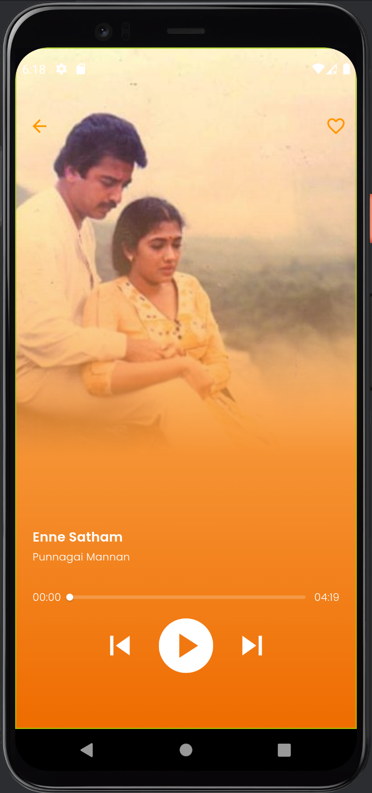

# Music Streaming App

A music streaming app that allows users to browse a collection of songs, play them, and favorite their favorites.

## Screens

### Pages

1. Splash page
2. Login Page
3. Home Page
4. Details Page

### 1. Splash Page

The Splash page displays for 2 seconds and automatically move to registration page if user is not registered. Else move to the home page.

|  |
|:-------------------------------------------------------------------------------:|
|                                  Splash Screen                                  |

### 2. Login Page

The login page allows users to sign up or log in using their email and password. Firebase Authentication is used for secure user authentication, enabling simultaneous login from multiple devices.

|  |  |
|:-------------------------------------------------------------------------------:|:-----------------------------------------------------------------------------:|
|                                   Signup Page                                   |                                  Login Page                                   |

|  |  |
|:-----------------------------------------------------------------------------------------:|:----------------------------------------------------------------------------------------------:|
|                                        Registering                                        |                                    Firebase Authentication                                     |

### 3. Home Page

The home page displays a list of songs fetched from local assets, along with a search bar. It presents more than 10 songs and supports searching by song names or descriptions. Users can navigate to the details page by selecting a song and also favorite songs directly from this page. Data caching is implemented using Shared Preferences.

|  |  |
|:--------------------------------------------------------------------------------:|:-------------------------------------------------------------------------------:|
|                                    Home Page                                     |                               Search in Home page                               |

### 4. Details Page

The details page provides information about a selected song, including its name, movie name (if applicable), and controls for playing and favoriting the song. Clicking the play button initiates playback, changing to a pause button during playback, and to a retry button upon completion.

|  |
|:------------------------------------------------------------------------------------:|
|                                     Detail Page                                      |

## Favoriting and Syncing Requirements

The app ensures that favorited songs remain consistent across multiple devices when a user is logged in. Firebase Realtime Database is used for syncing favorited songs, allowing offline changes to be saved and synced when the user goes online.

|  |  |
|:---------------------------------------------------------------------------------------------:|:-------------------------------------------------------------------------------------------------:|
|                                     Favorite in Home Page                                     |                                      Favorite in Detail Page                                      |

|  |
|:------------------------------------------------------------------------------------------------------:|
|                                   Firebase Realtime DB Favorite List                                   |

## General Requirements

1. The app incorporates hero animation for smooth transitions between the list and details screens.
2. It boasts an attractive and interactive UI design, with support for dark theme.
3. Code follows SOLID design principles and adheres to clean code guidelines, emphasizing readability and maintainability. Both BLoC and Provider patterns are utilized for state management.

|  |
|:---------------------------------------------------------------------------------------:|
|                                        Settings                                         |

|  |  |
|:-----------------------------------------------------------------------------------------------:|:---------------------------------------------------------------------------------------------:|
|                                        Light Mode Theme                                         |                                        Dark Mode Theme                                        |
